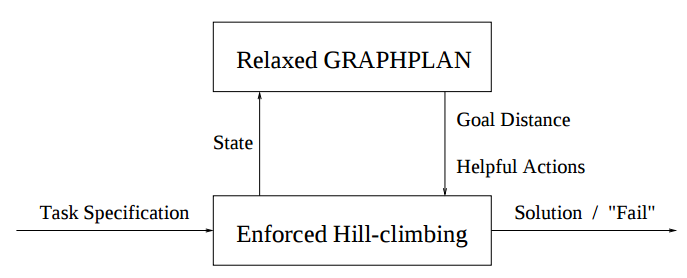
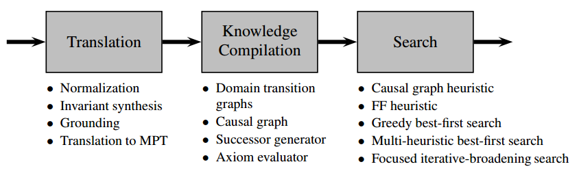

# Research Review

## FF Planning System

* Article: http://www.cs.toronto.edu/~sheila/2542/s14/A1/hoffmannebel-FF-jair01.pdf
* Winner of classical track of International Planning Competition at ICAPS 2000.

* The fundamental heuristic technique in FF is relaxed GRAPHPLAN. The technique gets called on every search state by enforced hill-climbing, a forward searching engine. Given a state, relaxed GRAPHPLAN informs the search with a goal distance estimate, and additionally with a set of promising successors for the state, the helpful actions. Upon termination, enforced hill-climbing either outputs a solution plan, or reports that it has failed.
* The enforced hill-climbing starts out in the initial state.  Then, facing an intermediate search state S, a complete breadth first search starting out from S is invoked. This finds the closest better successor S0.  The path from S to S0 is added to the current plan, and search is iterated.  When a goal state is reached, search stops.

## FastDownward Planning System

* Article: http://gki.informatik.uni-freiburg.de/papers/helmert-jair06.pdf
* Winner of classical track of International Planning Competition at ICAPS 2004.

* It contains 3 phases: Translation, Knowledge compilation and search.
* In translation phase, the problem is translated into "multi-valued planning tasks" for better searching.
* In knowledge compilation phase, the critical information about the planning task is compiled into a number of data structures for efficient access.  Domain transition graphs, causal graph, successor generator and Axiom evaluator is built for searching phase.
* Several search algo can be choosed: Greedy best first search, Multi-heruistic best first search and Focused iterative-broadening search.

## LAMA Planner

* Article: http://www.jair.org/media/2972/live-2972-5181-jair.pdf
* Winner of classical track of International Planning Competition at ICAPS 2008.
* Based on FastDownward Planning System
* Causal graph heurisic is replaced with new heurisic derived from landmarks.
* LAMA weighs the estimated cost-to-go (as a measure of plan quality) against the estimated goal distance (as a measure of remaining search effort) by combining the values for the two estimates.
* After finding an initial solution with a greedy best-first search, it conducts a series of weighted A∗ searches with decreasing weights, restarting the search each time from the initial state when an improved solution is found.
